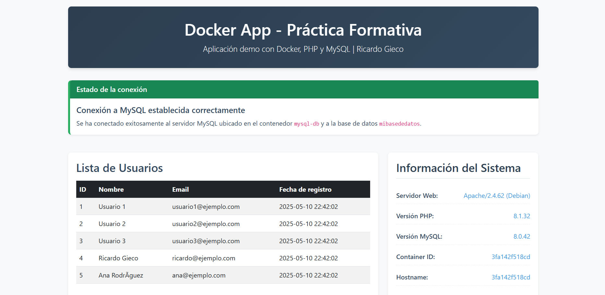

# Mi Aplicación Web con Docker

Esta es una aplicación web simple que muestra una lista de usuarios desde una base de datos MySQL, utilizando Docker, Nginx y PHP.

## Disponible en Docker Hub

Esta aplicación está disponible como imagen en Docker Hub:
```
hatusil/mi-app-web:1.0
```
(Reemplaza "tuusuario" con el nombre de usuario real en Docker Hub)

## Estructura del Proyecto

```
mi-app-web/
├── default.conf         # Configuración de Nginx
├── docker-compose.yml   # Configuración de desarrollo
├── docker-compose-deploy.yml  # Configuración para uso de la imagen publicada
├── Dockerfile           # Configuración para la imagen de PHP
├── index.php            # Página principal de la aplicación
├── init_db.sql          # Script SQL para inicializar la base de datos
├── test_db.php          # Script de diagnóstico de conexión
└── wait-for-mysql.sh    # Script para esperar a MySQL
```

## Requisitos

- Docker
- Docker Compose

## Cómo usar esta imagen desde Docker Hub

### Método 1: Usando docker-compose-deploy.yml

1. Descarga los archivos necesarios:
   - docker-compose-deploy.yml
   - default.conf
   - init_db.sql

2. Ejecuta la aplicación con Docker Compose:
   ```bash
   docker-compose -f docker-compose-deploy.yml up -d
   ```

3. Accede a la aplicación en tu navegador:
   ```
   http://localhost:8080
   ```

### Método 2: Usando Docker Run

1. Crea una red de Docker:
   ```bash
   docker network create mi-red-app
   ```

2. Inicia un contenedor MySQL:
   ```bash
   docker run --name mysql-db \
     --network mi-red-app \
     -e MYSQL_ROOT_PASSWORD=mipassword \
     -e MYSQL_DATABASE=mibasededatos \
     -d mysql:8.0
   ```

3. Inicializa la base de datos:
   ```bash
   # Crea un archivo init_db.sql con el contenido del script SQL
   docker cp init_db.sql mysql-db:/init_db.sql
   docker exec -i mysql-db sh -c 'mysql -u root -pmipassword mibasededatos < /init_db.sql'
   ```

4. Inicia el contenedor PHP con la imagen:
   ```bash
   docker run --name php-app \
     --network mi-red-app \
     -d tuusuario/mi-app-web:1.0
   ```

5. Inicia el servidor web Nginx:
   ```bash
   # Crea un archivo default.conf con la configuración de Nginx
   docker run --name webserver \
     --network mi-red-app \
     -p 8080:80 \
     -v $(pwd)/default.conf:/etc/nginx/conf.d/default.conf \
     -d nginx:alpine
   ```

6. Accede a la aplicación en tu navegador:
   ```
   http://localhost:8080
   ```

## Para desarrolladores: Cómo construir y publicar tu propia imagen

1. Clona este repositorio

2. Construye la imagen:
   ```bash
   docker build -t tuusuario/mi-app-web:1.0 .
   ```

3. Inicia sesión en Docker Hub:
   ```bash
   docker login
   ```

4. Sube la imagen:
   ```bash
   docker push tuusuario/mi-app-web:1.0
   ```

## Solución de problemas

Si experimentas problemas con la conexión a la base de datos:

1. Asegúrate de que todos los contenedores estén funcionando:
   ```bash
   docker-compose ps
   ```

2. Verifica los logs:
   ```bash
   docker-compose logs mysql
   docker-compose logs php
   docker-compose logs nginx
   ```

3. Accede a la herramienta de diagnóstico:
   ```
   http://localhost:8080/test_db.php
   ```

4. Para reiniciar la aplicación:
   ```bash
   docker-compose down
   docker-compose up -d
   ```

## Capturas de pantalla



## Licencia

Este proyecto está disponible bajo la licencia MIT.

## Autor

Hatusil


# Solución de Problemas de Conexión MySQL-PHP

Si estás experimentando problemas con la conexión entre PHP y MySQL en tu entorno Docker, aquí hay una guía paso a paso para solucionarlos.

## Problema: "Connection refused" al intentar conectar PHP con MySQL

### Pasos para solucionar

1. **Reiniciar los contenedores completamente**

```bash
# Detener y eliminar todos los contenedores
docker-compose down

# Eliminar volúmenes (opcional - ¡atención! se borrarán los datos guardados)
docker-compose down -v

# Reconstruir las imágenes
docker-compose build --no-cache

# Iniciar de nuevo los contenedores
docker-compose up -d
```

2. **Verificar que los contenedores estén funcionando**

```bash
docker-compose ps
```

Todos los contenedores deben mostrar el estado "Up".

3. **Comprobar los logs de cada contenedor**

```bash
# Ver logs de MySQL
docker-compose logs mysql

# Ver logs de PHP
docker-compose logs php

# Ver logs de Nginx
docker-compose logs nginx
```

4. **Probar la conexión manualmente**

```bash
# Acceder al contenedor de PHP
docker exec -it php-app bash

# Dentro del contenedor, probar conexión a MySQL
ping mysql-db
mysql -h mysql-db -u root -pmipassword -e "SHOW DATABASES;"
```

5. **Verificar la red de Docker**

```bash
# Listar las redes
docker network ls

# Inspeccionar la red de la aplicación
docker network inspect mi-red-app
```

6. **Modificar el tiempo de espera para la conexión**

Si el problema persiste, puedes intentar aumentar el tiempo de espera en el archivo index.php:
- Aumenta el número de intentos (`$maxRetries`)
- Aumenta el tiempo entre intentos (`sleep()`)

7. **Prueba cambiando el nombre del host**

Si estás usando "mysql-db" como nombre de host en PHP, intenta también con:
- "mysql" (nombre del servicio en docker-compose.yml)
- "127.0.0.1" (localhost)

## Si nada funciona

Si después de intentar todas las soluciones anteriores todavía tienes problemas:

1. **Prueba una configuración mínima**
   - Simplifica tu docker-compose.yml eliminando volúmenes y configuraciones avanzadas
   - Usa la imagen oficial de PHP con Apache en lugar de PHP-FPM + Nginx

2. **Comprueba los puertos y firewalls**
   - Verifica que no haya conflictos de puertos
   - Comprueba que no haya firewalls bloqueando la comunicación entre contenedores

3. **Usa phpMyAdmin para verificar la conexión a la base de datos**
   - Agrega phpMyAdmin a tu docker-compose.yml como una herramienta de diagnóstico